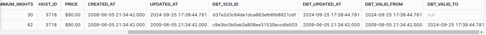
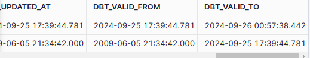

Welcome to your new dbt project!

### Using the starter project

Try running the following commands:
- dbt run
- dbt test


### Resources:
- Learn more about dbt [in the docs](https://docs.getdbt.com/docs/introduction)
- Check out [Discourse](https://discourse.getdbt.com/) for commonly asked questions and answers
- Join the [chat](https://community.getdbt.com/) on Slack for live discussions and support
- Find [dbt events](https://events.getdbt.com) near you
- Check out [the blog](https://blog.getdbt.com/) for the latest news on dbt's development and best practices

------------------------------------------------------------------------------------------------------------

# Instalação

Este é um projeto baseado nos meus estudos realizados a partir do curso https://www.udemy.com/course/complete-dbt-data-build-tool-bootcamp-zero-to-hero-learn-dbt. Os dados utilizados nesse curso sao disponibilizados
pelo curso atraves de um arquivo .csv, baixado via acesso ao S3. Para utilizar o dbt é necessário a escolha de um conector (ou mais de um) que será
utilizado para integração a base de dados, que nesse curso será o Snowflake, portanto apos criar um ambiente virtual instale:

```
pip install dbt-snowflake
```
E execute:
```
dbt init
```
Neste momento sera necessario informar configurações referente ao projeto e do seu datawarehouse no snowflake, como o usuario, senha, role, datawarehouse, database e schema default. Após esta etapa o dbt criara uma pasta com o nome do seu projeto com a seguinte estrutura:

```
├── analyses
├── dbt_packages
├── dbt_project.yml
├── logs
├── macros
├── models
├── README.md
├── seeds
├── snapshots
├── target
└── tests
```
O arquivo dbt_project.yml possui as configurações gerais do projeto.

-----------------------------------------------------------------------------------
## Models

A pasta models é onde os scripts sql serão deixados, a saída da query sera 
materializado em uma view por padrão, porém caso especificado poder
materializado em uma table, incremental ou ephemeral. Tais especificações
podem ser feitas a nivel de script, com o comando no inicio do script:
```
{{ 
  config(
    materialized='table', 
    schema='meu_schema_personalizado'
  ) 
}}
```
Que por exemplo define uma table em uma schema que não é o default, ou a nível
de pasta no arquivo dbt-project.yml. Por exemplo, para a pasta models/dim pode 
ser definido que o a matrialization default é table com as configurações:
```
models:
  dbtlearn:
      +materialized: view
      dim:
        +materialized: table
```
Após adicionar os scripts SQL basta dar o comando 
```
dbt run
```

Na pasta models/src são criadas as views SRC_LISTINGS, SRC_REVIEWS e SRC_HOSTS no database no snowflake e nas pastas dim sao aplicados transformações utilizando o jinja para referencia-las. 

-----------------------------------------------------------------------
## Incremental

Um caso comum são dados que são adicionados de forma periódica,por padrão o DBT sobreescrve as tabelas/views e portanto no caso em que esse comportamento não é desejado a sua materialização tem que ser a Incremental.

```
{{
  config(
    materialized = 'incremental',
    on_schema_change='fail'
    )
}}
WITH src_reviews AS (
  SELECT * FROM {{ ref('src_reviews') }}
)
SELECT * FROM src_reviews
WHERE review_text is not null


  AND review_date > (select max(review_date) from {{ this }})

```
Note que sobre o resultado do select é aplicado uma condição para quais linhas serão adiconadas/atualizadas.

-----------------------------------------------------------------------
## Ephemeral

Tabelas Ephemeral são tabelas que nao são escritas no banco de dados, poupando espaço de armazenamendo, 
por outro lado, nao é aconselhavel utilizalas  em casos de transformações elaboradas visto que será necessário 
refazer essas transformações.

-------------------------------------------------------------------------
## Seed

Para adicionar fonte da dados diretamente de arquivos podemos usar as seeds, na pasta seeds adicione o arquivo e de o comando:
```
dbt seed
```
Isso ira criar a table a partir dos arquivos na pasta seed.

-> Commmit = "Initial Structure"

-------------------------------------------------------------------------
## Source

Source é uma boa prática para referenciar tabelas criadas e gerenciadas fora do escopo do dbt, ao referenciar a source é possível testar e documentar essas tabelas. Para referencia-las é necessário criar um arquivo .yml em models, como no exemplo abaixo:
```
version: 2

sources:
  - name: airbnb
    schema: raw
    tables:
      - name: listings
        identifier: raw_listings

      - name: hosts
        identifier: raw_hosts

      - name: reviews
        identifier: raw_reviews
        loaded_at_field: date
        freshness:
          warn_after: {count: 1, period: hour}
          error_after: {count: 24, period: hour}
```
No exemplo anterior, freshness é referente ao campo date, que caso a data referente seja mais antiga que 1 hora em relação ao momento atual, o dbt emite um aviso, caso seja mais antiga que 24 horas ele emite um erro. Para verificar
```
dbt source freshness
```

Note que anteriormente, referenciamos as tabelas no schema RAW diretamente nos scrits sql, utilizando o alias definido no arquivo sources.yml, como exemplo veja o script (utilizar o ref para referenciar tabelas sources ira gerar um erro, devemos sempre usar o source()):
```
WITH raw_hosts AS (
    SELECT * FROM {{ source('airbnb','hosts') }}
)
SELECT
    id AS host_id,
    name AS host_name,
    is_superhost,
    created_at,
    updated_at 
FROM
    raw_hosts
```

-------------------------------------------------------------------

## Snapshots

Imagine a situação em para um objeto um dado associado muda ao longo do tempo, como por exemplo o email de login de um usuario em uma plataforma. Por diversos motivos é intererssante ter um registro dessa mudança ao longo do tempo, o que chamamos de snapshot.

O dbt oferece como recurso uma abstração da implementação de um snapshot (o código em si gerado pelo dbt irá depender do conector utilizado). Existem duas formas oferecidas pelo dbt para a implementação do snapshot:

- Timestamp:

- Check

Para exemplificar o primeiro caso crie o script snapshots/scd_raw_hosts.sql
```


{{
   config(
       target_schema='DEV',
       unique_key='id',
       strategy='timestamp',
       updated_at='updated_at',
       invalidate_hard_deletes=True
   )
}}

select * FROM {{ source('airbnb', 'listings') }}


```
De o comando:
```
dbt snapshot
```
Note que o dbt criou uma quatro colunas, dbt_scd_id dbt_updated_at, dbt_valid_from, dbt_valid_to.

Atualize uma das linhas no banco de dados:

```
UPDATE AIRBNB.RAW.RAW_LISTINGS SET MINIMUM_NIGHTS=30,
    updated_at=CURRENT_TIMESTAMP() WHERE ID=3176;

SELECT * FROM AIRBNB.DEV.SCD_RAW_LISTINGS WHERE ID=3176;
```
Note que o select retorna a linha com a coluna dbt_valid_to como null, para que o snapshot atualize é necessário dar o comando dbt snapshot novamente, note agora que a tabela utilizada como snapshot AIRBNB.DEV.SCD_RAW_LISTINGS retorna o duas linhas com a linha atualizada:



Agora a linha com o campo dbt_valid_to null representa o campo mais atual, enquanto para o registro anterior voce tera o registro da data que foi inserido (dbt_valid_from) e data que foi mudado (dbt_valid_to). Os outros dois campos criados pelo dbt são para gerenciamento interno.

Para utilizar essa estrategia de snapshot é importante ter um campo timestamp (que aqui é o updated_at) que será utilizado pelo dbt para registrar os campos dbt_valid_from, dbt_valid_to e uma campo unique (nesse caso o id).

Por padrão o dbt nao atualiza no snapshot linhas deletadas (ficando o ultimo registro como null), para atualizar use 
invalidate_hard_deletes=True. Apos apagar a linha e der dbt snapshot a tabela de snap shot ficara:



Outra abordagem quando uma tabela não possui uma coluna com data de atualização é utilizar a estrategia check, que verifica mudanças nas colunas selecionadas, 
como exemplo tome o codigo:
```


    {{
        config(
          schema='snapshots',
          strategy='check',
          unique_key='id',
          check_cols=['status', 'is_cancelled'],
        )
    }}

    select * from {{ source('jaffle_shop', 'orders') }}


```

## Tests

Há dois tipos de testes, testes singulares e testes genéricos. Testes singulares são queries SQL que esperam retornar resultados vazios. 

O dbt possui 4 testes built-in:
- unique
- not_null
- accepted_values
- Relationships

Também você pode construir os seus próprios testes genéricos.

### Tests genéricos

Para criar um teste genérico crie um arquivo models/schema.yml:

```
version: 2

models:
  - name: dim_listings_cleansed
    columns:

     - name: listing_id
       tests:
         - unique
         - not_null

     - name: host_id
       tests:
         - not_null
         - relationships:
             to: ref('dim_hosts_cleansed')
             field: host_id

     - name: room_type
       tests:
         - accepted_values:
             values: ['Entire home/apt',
                      'Private room',
                      'Shared room',
                      'Hotel room']
```
Data Warehouse com o postgres já possuem como recurso condições de unicidade e não nulos, porém nem todos Data Warehouses possuem este recurso, dessa forma o dbt implementa sua verificação.

Note que estamos  usando os testes built-in no schema.yml, porém podemos construir os nossos própios testes com a conceito de macros, que veremos posteriormente.

Para rodar o teste:
```
dbt test
```
Para rodar testes especificos a uma tabela:
```
dbt test --select <nome-da-tabela>
```

### Singular Tests

Para criar um teste singular basta criar um script SQL em tests/, veja o exemplo em dim_listings_minumum_nights.sql. Caso o retorno da query seja não vazio teremos um erro.

```
SELECT
    *
FROM
    {{ ref('dim_listings_cleansed') }}
WHERE minimum_nights < 1
LIMIT 10
```

## Macros